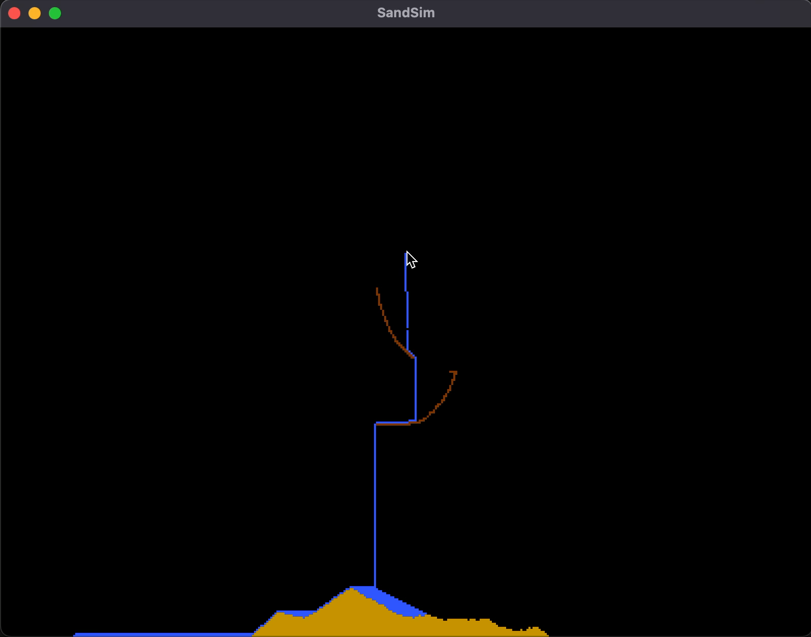

## High-Level Overview

This is an attempt to recreate Noita's particle simulation in Java. I'm using a similar approach to former attempts by using cellular automata to manage interactions between particles.

## Program Structure

The program will be primarily composed of the SandSim class, in which the majority of the cellular automaton's logic is contained, as well as the windowing and graphics for GLFW. The addition of the GLSL files was done in order to allow for this program to support an 
extrememly high amount of particles within the sandbox without a proportionate gain in computing overhead.

## Dependencies

This project is built using Maven, and uses the Light Weight Game Library for Java, in order to access OpenGL/GLFW bindings for Java.

## How to Use

This sandbox is split into three different particle types. Each of which can be accessed by toggling between the "1" (sand), "2" (water), and "3" (wood) keys. Then, by holding down or clicking the left mouse button, one can instantiate these particles into the sandbox.

